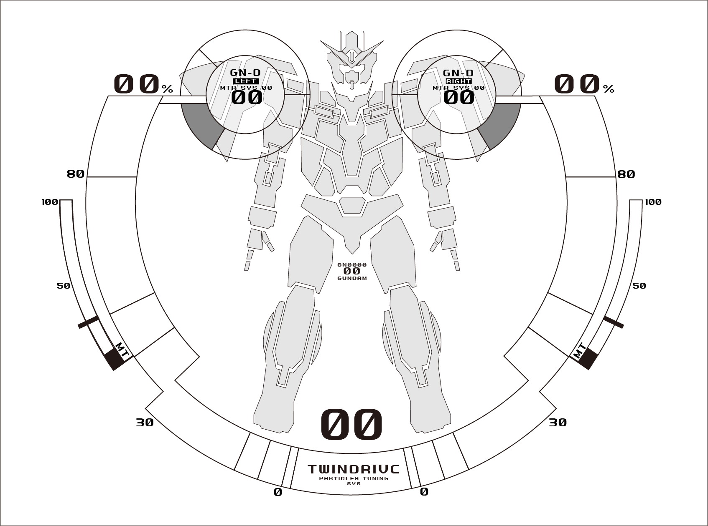
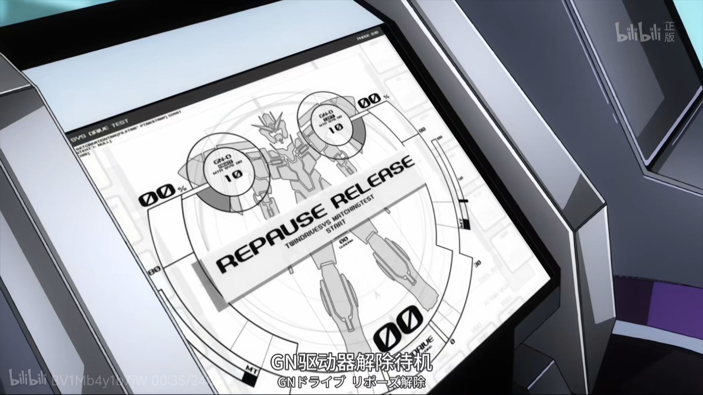
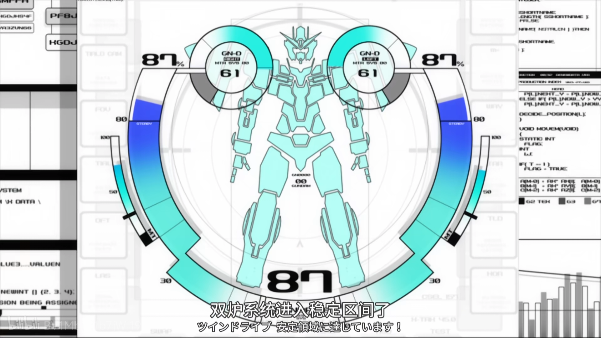
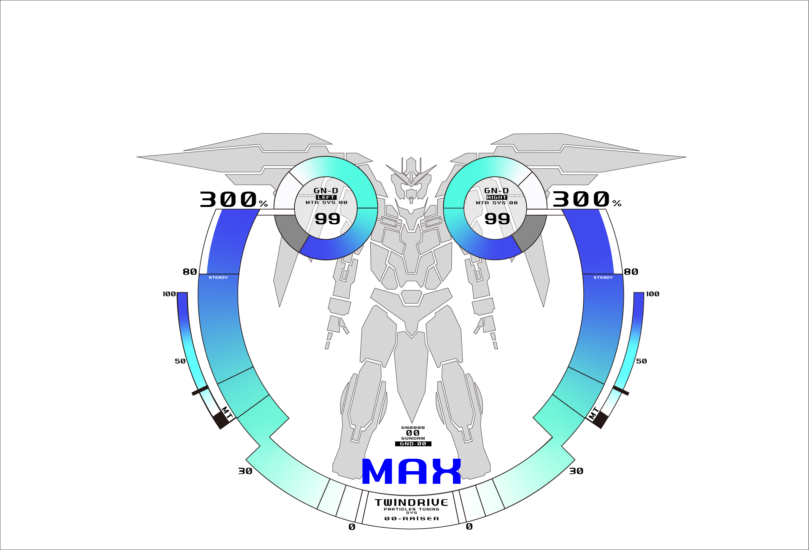
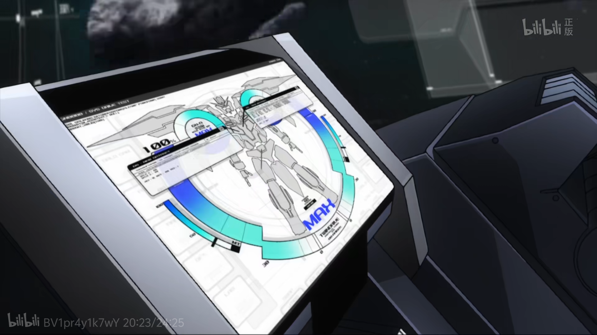

# Resources-of-GUNDAM-00-system-materials
This Repo is try to collect resources related to operation system materials in Mobile Suit Gundam 00 (a Japanese anime). All of resource produced by unofficial individuals and obtained author's authorization. 

本仓库致力于收集高达00动画中出现过的操作系统相关ui素材，所有资源来自非官方的个人制作并已获取作者授权。

# GN-0000 00 GUNDAM 搭载系统素材
## Author：[阔落咸鱼2025](https://space.bilibili.com/20686294)
## Deactive mode

00 的未启动转态。剧照参考:

## Active mode
<video src="./sample.mp4" controls width="600"></video>

剧照参考:

00 Gundam第一次Twin-Drive同步成功时的画面。00身体部分从灰色变成青色，比较少见。演示效果使用[rainmeter](https://www.rainmeter.net/)实现。如果对该demo感兴趣请持续关注本仓库。

## O-Raiser

00 Gundam和O-Raiser对接后的系统画面。参考：

